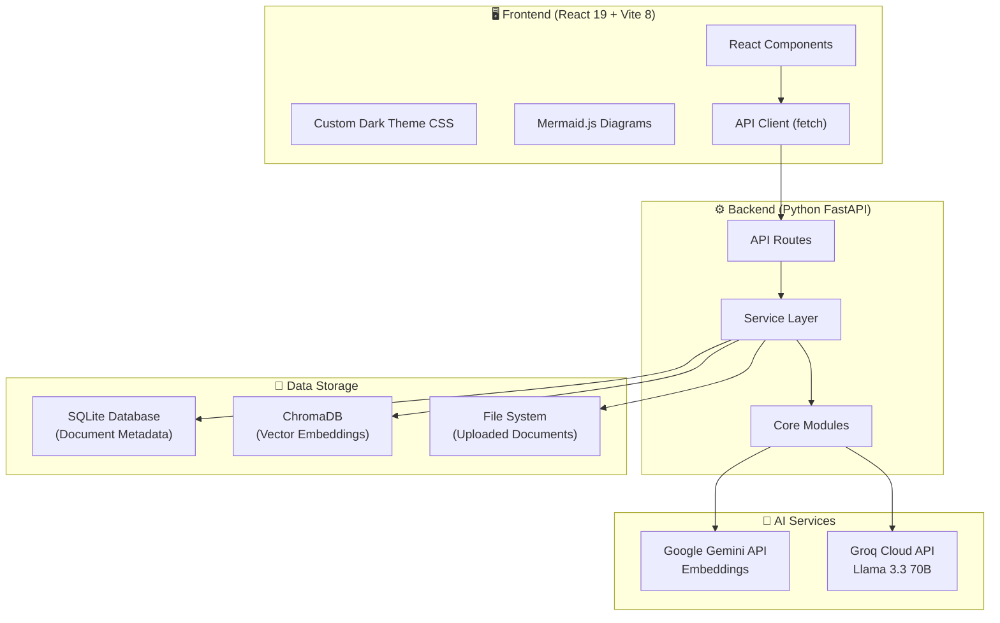
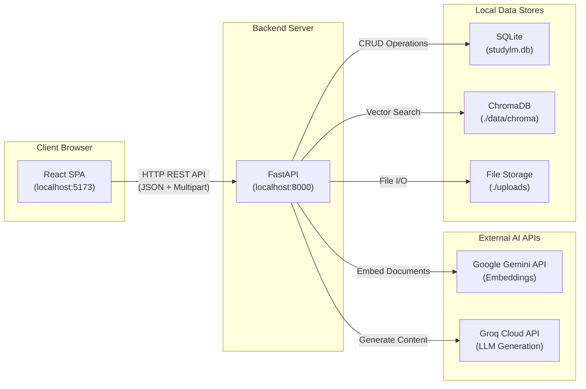
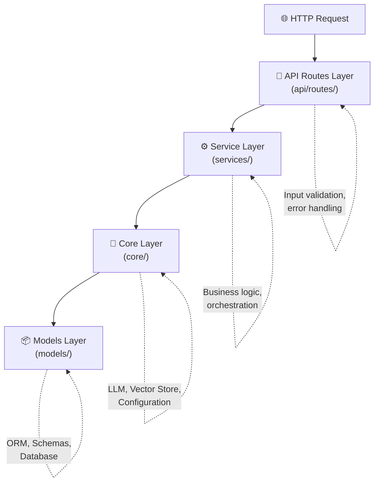
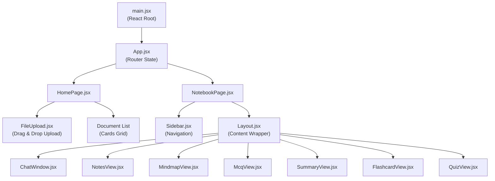
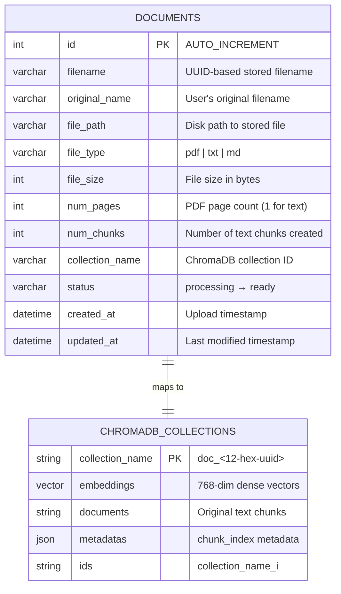
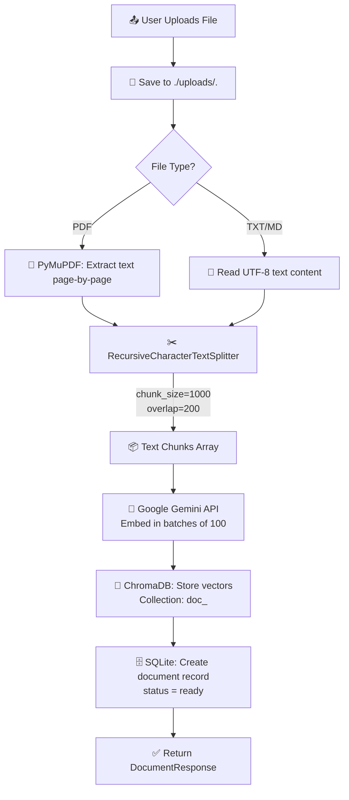
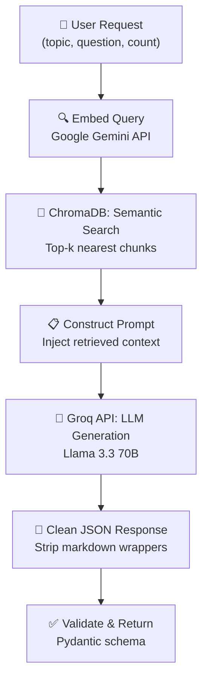
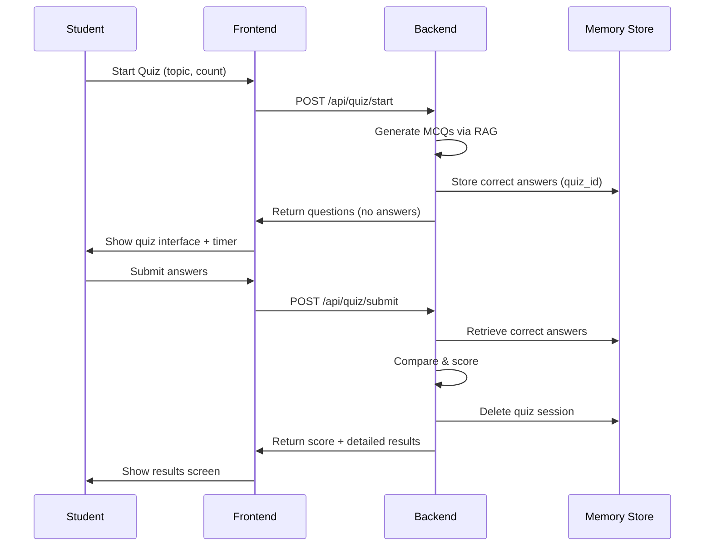
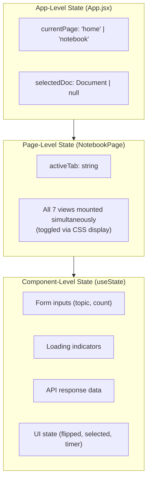
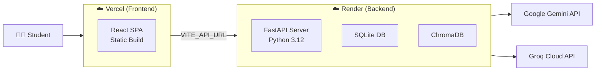

# 📚 StudyLM — AI-Powered Student Study Assistant

### Complete Project Documentation

> **Version:** 1.0.0 | **Author:** StudyLM Team | **Last Updated:** August 2025

---

## Table of Contents

1. [Executive Summary](#1-executive-summary)
2. [Project Overview](#2-project-overview)
3. [Technology Stack](#3-technology-stack)
4. [System Architecture](#4-system-architecture)
5. [Backend Architecture](#5-backend-architecture)
6. [Frontend Architecture](#6-frontend-architecture)
7. [Feature Breakdown](#7-feature-breakdown)
8. [API Reference](#8-api-reference)
9. [Database Schema](#9-database-schema)
10. [Data Flow Pipeline](#10-data-flow-pipeline)
11. [Prompt Engineering](#11-prompt-engineering)
12. [State Management](#12-state-management)
13. [Design System & UI/UX](#13-design-system--uiux)
14. [Configuration & Environment](#14-configuration--environment)
15. [Deployment Guide](#15-deployment-guide)
16. [Project Structure](#16-project-structure)
17. [Getting Started](#17-getting-started)
18. [Dependencies](#18-dependencies)
19. [Security Considerations](#19-security-considerations)
20. [Future Scope](#20-future-scope)

---

## 1. Executive Summary

**StudyLM** is a full-stack, AI-powered study assistant application inspired by Google's NotebookLM. It enables students to upload their study materials (PDFs, text files, markdown documents) and leverage advanced AI models to generate interactive study tools — including smart notes, MCQs, summaries, flashcards, mind maps, timed quizzes, and a document-grounded Q&A chatbot.

The application follows a **Retrieval-Augmented Generation (RAG)** architecture, combining vector-based semantic search with large language model generation to produce accurate, context-grounded outputs directly from the student's own study material.

### Key Highlights

| Aspect | Details |
|--------|---------|
| **Architecture** | Full-stack SPA with RESTful API backend |
| **AI Models** | Google Gemini (embeddings) + Groq/Llama 3.3 70B (generation) |
| **Vector Database** | ChromaDB (persistent, per-document collections) |
| **Relational Database** | SQLite via SQLAlchemy ORM |
| **Frontend** | React 19 + Vite 8 + Mermaid.js |
| **Backend** | Python FastAPI + LangChain |
| **Deployment** | Render (backend) + Vercel (frontend) |

---

## 2. Project Overview

### 2.1 Problem Statement

Students often struggle with:
- Extracting key concepts from lengthy study materials
- Creating effective revision tools (flashcards, MCQs) manually
- Testing their understanding through self-assessment
- Quickly finding answers within large documents

### 2.2 Solution

StudyLM automates the creation of 7 distinct study tools from any uploaded document, powered by AI:

```
┌──────────────────────────────────────────────────────────────┐
│                    📄 Upload Study Material                  │
│                   (PDF, TXT, Markdown)                       │
└─────────────────────────┬────────────────────────────────────┘
                          │
                          ▼
┌──────────────────────────────────────────────────────────────┐
│                  🧠 AI Processing Pipeline                   │
│          Parse → Chunk → Embed → Store → Retrieve            │
└─────────────────────────┬────────────────────────────────────┘
                          │
          ┌───────────────┼───────────────┐
          ▼               ▼               ▼
    ┌───────────┐  ┌───────────┐  ┌───────────┐
    │  💬 Chat  │  │  📝 Notes │  │  🗺️ Mind  │
    │   Q&A     │  │ Generator │  │    Map     │
    └───────────┘  └───────────┘  └───────────┘
          ▼               ▼               ▼
    ┌───────────┐  ┌───────────┐  ┌───────────┐
    │  ❓ MCQ   │  │  📋 Sum-  │  │  🃏 Flash │
    │ Generator │  │   mary    │  │   cards   │
    └───────────┘  └───────────┘  └───────────┘
                        ▼
                  ┌───────────┐
                  │  📊 Quiz  │
                  │   Mode    │
                  └───────────┘
```

---

## 3. Technology Stack

### 3.1 Stack Overview Diagram



### 3.2 Technology Breakdown

| Layer | Technology | Version | Purpose |
|-------|-----------|---------|---------|
| **Frontend Framework** | React | 19.2.4 | Component-based UI |
| **Build Tool** | Vite | 8.0.1 | Fast dev server & bundler |
| **Diagrams** | Mermaid.js | 11.13.0 | Mind map rendering |
| **Backend Framework** | FastAPI | Latest | Async REST API server |
| **ASGI Server** | Uvicorn | Latest | Production-grade ASGI |
| **LLM Orchestration** | LangChain | Latest | Prompt templates & chains |
| **Text Generation** | Groq (Llama 3.3 70B) | — | Fast LLM inference |
| **Embeddings** | Google Gemini | gemini-embedding-001 | Semantic text embeddings |
| **Vector Store** | ChromaDB | Latest | Persistent vector search |
| **PDF Parsing** | PyMuPDF (fitz) | 1.28.0 | PDF text extraction |
| **ORM** | SQLAlchemy | 2.0.51 | Database abstraction |
| **Database** | SQLite | — | Lightweight relational DB |
| **Validation** | Pydantic | v2 | Request/response schemas |
| **Env Management** | python-dotenv | — | Environment variables |

---

## 4. System Architecture

### 4.1 High-Level Architecture Diagram



### 4.2 Architectural Principles

| Principle | Implementation |
|-----------|---------------|
| **Separation of Concerns** | 4-tier architecture: Routes → Services → Core → Models |
| **RAG Pattern** | Retrieval-Augmented Generation for grounded AI outputs |
| **Per-Document Isolation** | Each document gets its own ChromaDB collection |
| **Stateless API** | All endpoints are stateless except quiz sessions (in-memory) |
| **CORS Enabled** | Open CORS for frontend-backend communication |
| **Async I/O** | FastAPI async handlers for non-blocking requests |

---

## 5. Backend Architecture

### 5.1 Layered Architecture



### 5.2 Module Responsibilities

| Module | Path | Responsibility |
|--------|------|---------------|
| **Routes** | `api/routes/` | HTTP endpoint definitions, request validation, error handling |
| **Services** | `services/` | Business logic, RAG pipeline orchestration, LLM invocation |
| **Core** | `core/` | LLM initialization, vector store management, app configuration |
| **Models** | `models/` | SQLAlchemy ORM models, Pydantic schemas, database session |
| **Prompts** | `prompts/` | Carefully crafted prompt templates for each feature |

### 5.3 Core Module Details

#### LLM Configuration (`core/llm.py`)

```python
# Text Generation — Groq Cloud (Llama 3.3 70B Versatile)
ChatGroq(
    model="llama-3.3-70b-versatile",
    api_key=settings.GROQ_API_KEY,
    temperature=0.3
)
```

#### Vector Store (`core/vectorstore.py`)

```python
# Embeddings — Google Gemini
GoogleGenerativeAIEmbeddings(
    model="models/gemini-embedding-001",
    google_api_key=settings.GOOGLE_API_KEY
)

# Storage — ChromaDB Persistent Client
chromadb.PersistentClient(path="./data/chroma")
```

#### Configuration (`core/config.py`)

| Setting | Default Value | Description |
|---------|--------------|-------------|
| `LLM_MODEL` | `llama-3.3-70b-versatile` | Groq model for text generation |
| `EMBEDDING_MODEL` | `models/gemini-embedding-001` | Google Gemini embedding model |
| `CHUNK_SIZE` | `1000` | Characters per text chunk |
| `CHUNK_OVERLAP` | `200` | Overlapping characters between chunks |
| `EMBEDDING_BATCH_SIZE` | `100` | Chunks embedded per API call |
| `ALLOWED_FILE_TYPES` | `pdf, txt, md, text` | Accepted upload formats |

---

## 6. Frontend Architecture

### 6.1 Component Hierarchy



### 6.2 Component Descriptions

| Component | Purpose | Key Features |
|-----------|---------|-------------|
| **`App.jsx`** | Root component & page router | State-based routing (`home` ↔ `notebook`) |
| **`HomePage.jsx`** | Landing page | Upload dropzone, document history grid |
| **`NotebookPage.jsx`** | Workspace page | Sidebar + 7 tab views (all mounted, toggled by CSS) |
| **`FileUpload.jsx`** | Document upload | Drag-and-drop, file validation, progress feedback |
| **`Sidebar.jsx`** | Navigation drawer | Document info, 7 feature tabs, back button |
| **`ChatWindow.jsx`** | AI Q&A chat | Message history, markdown formatting, source chips |
| **`NotesView.jsx`** | Smart notes | Topic input, structured markdown output, key points |
| **`MindmapView.jsx`** | Visual mind map | Mermaid.js SVG rendering, raw code viewer |
| **`McqView.jsx`** | MCQ practice | Configurable count, instant answer check, explanations |
| **`SummaryView.jsx`** | Document summary | Topic-focused summaries, key concepts list |
| **`FlashcardView.jsx`** | Flashcard deck | 3D flip animation, card navigation, progress counter |
| **`QuizView.jsx`** | Timed quiz mode | Setup → Active (timer) → Results (score ring) |
| **`Loading.jsx`** | Loading spinner | Reusable animated loading indicator |

### 6.3 Page Flow

```
┌─────────────────────────────────────────────────────────┐
│                      HOME PAGE                          │
│                                                         │
│  ┌─────────────────────────────────────────────────┐    │
│  │         📤 Upload Study Material                │    │
│  │      Drag & drop or click to browse             │    │
│  │       Supports: PDF, TXT, Markdown              │    │
│  └─────────────────────────────────────────────────┘    │
│                                                         │
│  ┌──────────┐  ┌──────────┐  ┌──────────┐              │
│  │ 📄 Doc 1 │  │ 📄 Doc 2 │  │ 📄 Doc 3 │  ...        │
│  │  AI.pdf  │  │ ML.txt   │  │ Bio.md   │              │
│  │ 5 pages  │  │ 1 page   │  │ 1 page   │              │
│  └──────────┘  └──────────┘  └──────────┘              │
└────────────────────────┬────────────────────────────────┘
                         │ Click Document
                         ▼
┌─────────────────────────────────────────────────────────┐
│                    NOTEBOOK PAGE                        │
│                                                         │
│  ┌──────────┐  ┌────────────────────────────────────┐  │
│  │ SIDEBAR  │  │         WORKSPACE AREA              │  │
│  │          │  │                                      │  │
│  │ ← Back   │  │  ┌──────────────────────────────┐  │  │
│  │          │  │  │    Active Feature View        │  │  │
│  │ 📄 Doc   │  │  │                              │  │  │
│  │  Info    │  │  │  (Chat / Notes / MindMap /    │  │  │
│  │          │  │  │   MCQ / Summary / Flash /     │  │  │
│  │ 💬 Chat  │  │  │   Quiz)                      │  │  │
│  │ 📝 Notes │  │  │                              │  │  │
│  │ 🗺️ Map   │  │  │                              │  │  │
│  │ ❓ MCQ   │  │  │                              │  │  │
│  │ 📋 Sum.  │  │  │                              │  │  │
│  │ 🃏 Flash │  │  │                              │  │  │
│  │ 📊 Quiz  │  │  └──────────────────────────────┘  │  │
│  │          │  │                                      │  │
│  └──────────┘  └────────────────────────────────────┘  │
└─────────────────────────────────────────────────────────┘
```

---

## 7. Feature Breakdown

### 7.1 Feature Matrix

| # | Feature | Icon | Backend Endpoint | Retrieval (k) | Description |
|---|---------|------|-----------------|---------------|-------------|
| 1 | **Document Chat** | 💬 | `POST /api/chat/ask` | Top-5 | RAG-powered Q&A grounded in document content |
| 2 | **Smart Notes** | 📝 | `POST /api/notes/generate` | Top-6 | Structured study notes with key points |
| 3 | **Mind Map** | 🗺️ | `POST /api/mindmap/generate` | Top-10 | Mermaid.js visual concept flowchart |
| 4 | **MCQ Generator** | ❓ | `POST /api/mcq/generate` | Top-6 | Multiple-choice questions with explanations |
| 5 | **Summary** | 📋 | `POST /api/summary/generate` | Top-8 | Concise document/topic summaries |
| 6 | **Flashcards** | 🃏 | `POST /api/flashcards/generate` | Top-6 | Interactive 3D flip flashcard decks |
| 7 | **Quiz Mode** | 📊 | `POST /api/quiz/start` + `/submit` | Top-8 | Timed assessment with scoring |

### 7.2 Feature Details

#### 💬 Document Chat (RAG Q&A)
- **How it works**: User asks a question → top-5 relevant chunks retrieved from ChromaDB → context injected into chat prompt → Groq LLM generates a grounded answer with source excerpts
- **Key feature**: Answers are strictly grounded in uploaded content — the model won't hallucinate information not present in the document
- **Output**: Markdown-formatted answer + source excerpt chips

#### 📝 Smart Notes Generator
- **How it works**: Optional topic/question input → top-6 chunks retrieved → LLM generates structured notes
- **Output**: Title, organized markdown content with headings, and bullet-point key takeaways

#### 🗺️ Mind Map Generator
- **How it works**: Top-10 chunks retrieved for broad coverage → LLM generates Mermaid.js `graph TD` flowchart code → rendered as interactive SVG in browser
- **Output**: Visual concept map with 15-20+ nodes showing relationships between key concepts
- **Special handling**: Response sanitized to strip markdown backticks, ensures valid Mermaid syntax

#### ❓ MCQ Generator
- **How it works**: Configurable question count (3, 5, 10, 15, 20) → top-6 chunks → LLM generates questions with 4 options (A-D)
- **Output**: Each question includes: question text, 4 labeled options, correct answer, detailed explanation
- **UX**: Instant answer checking with color-coded feedback (green = correct, red = wrong)

#### 📋 Summary Generator
- **How it works**: Optional topic focus → top-8 chunks → LLM produces concise summary
- **Output**: Title, overview paragraph, main concepts, and key concept bullet list

#### 🃏 Flashcard Generator
- **How it works**: Configurable card count → top-6 chunks → LLM generates front/back card pairs
- **Output**: Deck of flashcards (term/definition or Q&A format)
- **UX**: 3D CSS flip animation, card-by-card navigation with progress counter

#### 📊 Quiz Mode (Timed Assessment)
- **How it works**: 3-phase process:
  1. **Setup**: Choose topic and question count
  2. **Active Quiz**: Live stopwatch timer, navigate through questions, select answers
  3. **Results**: Score percentage ring, correct/wrong breakdown with explanations
- **Server-side scoring**: Correct answers stored in server memory during quiz, answers compared server-side to prevent cheating
- **Session management**: Quiz sessions auto-cleaned after submission

---

## 8. API Reference

### 8.1 Base URL

```
Development:  http://localhost:8000/api
Production:   https://<your-render-url>/api
```

### 8.2 Document Management

#### `POST /api/documents/upload`
Upload and process a study document.

| Parameter | Type | Required | Description |
|-----------|------|----------|-------------|
| `file` | `UploadFile` (multipart) | ✅ | PDF, TXT, or MD file |

**Response** (`DocumentResponse`):
```json
{
  "id": 1,
  "filename": "8541a16bdceb413b.txt",
  "original_name": "study_material.pdf",
  "file_type": "pdf",
  "file_size": 245000,
  "num_pages": 12,
  "num_chunks": 34,
  "status": "ready",
  "created_at": "2025-08-11T10:05:51"
}
```

#### `GET /api/documents/`
List all uploaded documents (ordered by newest first).

#### `GET /api/documents/{document_id}`
Get a specific document's metadata.

#### `DELETE /api/documents/{document_id}`
Delete a document (removes file, ChromaDB collection, and database record).

---

### 8.3 AI Feature Endpoints

#### `POST /api/chat/ask`
```json
// Request
{ "document_id": 1, "question": "What is machine learning?" }

// Response
{
  "answer": "Machine learning is a subset of AI that...",
  "sources": ["...relevant excerpt 1...", "...relevant excerpt 2..."]
}
```

#### `POST /api/notes/generate`
```json
// Request
{ "document_id": 1, "topic": "Neural Networks", "question": null }

// Response
{
  "title": "Neural Networks — Study Notes",
  "content": "## Overview\n\nNeural networks are...",
  "key_points": ["Point 1", "Point 2", "Point 3"]
}
```

#### `POST /api/mcq/generate`
```json
// Request
{ "document_id": 1, "topic": "Deep Learning", "num_questions": 5 }

// Response
{
  "topic": "Deep Learning",
  "questions": [
    {
      "question": "What is backpropagation?",
      "options": ["A) ...", "B) ...", "C) ...", "D) ..."],
      "correct_answer": "B",
      "explanation": "Backpropagation is..."
    }
  ]
}
```

#### `POST /api/summary/generate`
```json
// Request
{ "document_id": 1, "topic": "Chapter 3" }

// Response
{
  "title": "Chapter 3 Summary",
  "summary": "This chapter covers...",
  "key_concepts": ["Concept 1", "Concept 2"]
}
```

#### `POST /api/flashcards/generate`
```json
// Request
{ "document_id": 1, "topic": "Key Terms", "num_cards": 10 }

// Response
{
  "topic": "Key Terms",
  "cards": [
    { "front": "What is AI?", "back": "AI is intelligence demonstrated by machines..." }
  ]
}
```

#### `POST /api/mindmap/generate`
```json
// Request
{ "document_id": 1, "topic": "Overview" }

// Response
{
  "mermaid_code": "graph TD\n  A[Main Topic] --> B[Subtopic 1]\n  A --> C[Subtopic 2]..."
}
```

#### `POST /api/quiz/start`
```json
// Request
{ "document_id": 1, "topic": "Final Exam", "num_questions": 10 }

// Response (answers omitted for anti-cheat)
{
  "quiz_id": "abc123",
  "topic": "Final Exam",
  "num_questions": 10,
  "questions": [
    { "question": "...", "options": ["A)...", "B)...", "C)...", "D)..."] }
  ]
}
```

#### `POST /api/quiz/submit`
```json
// Request
{ "quiz_id": "abc123", "answers": ["A", "C", "B", "D", ...] }

// Response
{
  "total_questions": 10,
  "correct_answers": 7,
  "score_percentage": 70.0,
  "results": [
    {
      "question": "...",
      "your_answer": "A",
      "correct_answer": "B",
      "is_correct": false,
      "explanation": "..."
    }
  ]
}
```

#### `GET /health`
```json
{ "status": "ok", "app": "StudyLM" }
```

---

## 9. Database Schema

### 9.1 Entity Relationship Diagram



### 9.2 SQLite Schema (`documents` table)

```sql
CREATE TABLE documents (
    id              INTEGER PRIMARY KEY AUTOINCREMENT,
    filename        VARCHAR(255)  NOT NULL,
    original_name   VARCHAR(255)  NOT NULL,
    file_path       VARCHAR(500)  NOT NULL,
    file_type       VARCHAR(50)   NOT NULL,
    file_size       INTEGER       DEFAULT 0,
    num_pages       INTEGER       DEFAULT 0,
    num_chunks      INTEGER       DEFAULT 0,
    collection_name VARCHAR(255)  NOT NULL,
    status          VARCHAR(50)   DEFAULT 'processing',
    created_at      DATETIME      DEFAULT CURRENT_TIMESTAMP,
    updated_at      DATETIME      DEFAULT CURRENT_TIMESTAMP
);
```

---

## 10. Data Flow Pipeline

### 10.1 Document Upload & Processing Pipeline



### 10.2 Feature Generation Pipeline (RAG)



### 10.3 Quiz Session Flow



---

## 11. Prompt Engineering

### 11.1 Prompt Templates Overview

Each AI feature uses a carefully crafted prompt template stored in `prompts/`:

| Prompt File | Output Format | Key Instructions |
|------------|---------------|------------------|
| `chat_prompt.py` | JSON (`answer`, `sources`) | Strict context grounding, no hallucination |
| `notes_prompt.py` | JSON (`title`, `content`, `key_points`) | Structured markdown with headings |
| `mcq_prompt.py` | JSON array of questions | 4 options (A-D), correct answer, explanation |
| `summary_prompt.py` | JSON (`title`, `summary`, `key_concepts`) | Concise overview, key takeaways |
| `flashcard_prompt.py` | JSON array of cards | Short front/back pairs |
| `mindmap_prompt.py` | Raw Mermaid code | `graph TD`, 15-20 nodes, no special chars |

### 11.2 RAG Context Injection Pattern

All prompts follow this pattern:

```
[System Instructions]
  ↓
[Retrieved Context from ChromaDB]  ← Injected at runtime
  ↓
[Task-Specific Instructions]
  ↓
[Output Format Specification (JSON)]
```

### 11.3 JSON Output Cleaning

The `clean_json_response()` utility handles LLM output quirks:
1. Strips markdown code block wrappers (` ```json ... ``` `)
2. Finds outermost `{...}` or `[...]` brackets
3. Extracts clean JSON for reliable parsing

---

## 12. State Management

### 12.1 Frontend State Architecture



### 12.2 Key Design Decision: Persistent Tab State

All 7 feature views are **mounted simultaneously** in `NotebookPage` and toggled via CSS `display: block/none`. This means:
- ✅ Generated notes, chat history, flashcard progress persist across tab switches
- ✅ No unnecessary re-renders or API re-calls
- ✅ Seamless user experience switching between tools

### 12.3 Backend State

| State Type | Storage | Scope |
|-----------|---------|-------|
| Document metadata | SQLite | Persistent |
| Vector embeddings | ChromaDB | Persistent |
| Uploaded files | File system | Persistent |
| Quiz sessions | In-memory dict | Ephemeral (deleted after submission) |

---

## 13. Design System & UI/UX

### 13.1 Theme Overview

StudyLM features a **modern dark theme** with vibrant purple/violet accents and glassmorphism effects.

### 13.2 Color Palette

| Token | Value | Usage |
|-------|-------|-------|
| **Primary BG** | `#0a0a0f` | Body background |
| **Secondary BG** | `#12121a` | Section backgrounds |
| **Card BG** | `#1a1a2e` | Card surfaces |
| **Input BG** | `#16162a` | Form inputs |
| **Accent Gradient** | `#7c3aed → #a855f7 → #c084fc` | Buttons, highlights |
| **Success** | `#10b981` | Correct answers, confirmations |
| **Error** | `#ef4444` | Wrong answers, errors |
| **Warning** | `#f59e0b` | Caution states |
| **Info** | `#3b82f6` | Informational elements |

### 13.3 Design Features

- **Typography**: Google Fonts `Inter` — clean, modern, readable
- **Glassmorphism**: `backdrop-filter: blur(12px)` on glass elements
- **Gradient Text**: `.gradient-text` for premium heading effects
- **3D Animations**: CSS perspective transforms for flashcard flips
- **Micro-animations**: `fadeIn`, `slideInLeft`, `slideInRight`, `pulse`, `spin`, `shimmer`, `float`
- **Responsive Layout**: Sidebar (280px fixed) + fluid main content area

### 13.4 CSS Architecture

```
src/styles/
├── chat.css        # Chat window styling
├── flashcard.css   # 3D flip card animations
├── home.css        # Landing page layout
├── mcq.css         # MCQ cards and feedback
├── notebook.css    # Workspace layout
├── notes.css       # Notes content rendering
├── quiz.css        # Quiz timer, progress, results
├── sidebar.css     # Navigation drawer
└── upload.css      # Upload dropzone
```

Plus global styles in:
- `index.css` — Design tokens, utilities, animations, base styles
- `App.css` — App-level layout styles

---

## 14. Configuration & Environment

### 14.1 Backend Environment Variables (`.env`)

```env
# Required API Keys
GOOGLE_API_KEY="your_google_api_key"     # Google Gemini (embeddings)
GROQ_API_KEY="your_groq_api_key"         # Groq Cloud (text generation)

# Storage Paths
CHROMA_PATH=./data/chroma                # ChromaDB storage directory
UPLOAD_DIR=./uploads                     # Uploaded files directory
DATABASE_URL=sqlite:///./data/studylm.db # SQLite database path

# Optional Overrides
LLM_MODEL=llama-3.3-70b-versatile       # Groq model name
EMBEDDING_MODEL=models/gemini-embedding-001  # Gemini model name
CHUNK_SIZE=1000                          # Text chunk size (chars)
CHUNK_OVERLAP=200                        # Chunk overlap (chars)
EMBEDDING_BATCH_SIZE=100                 # Embedding batch size
ALLOWED_FILE_TYPES=pdf,txt,md,text       # Accepted upload types
```

### 14.2 Frontend Environment Variables

```env
VITE_API_URL=http://localhost:8000/api   # Backend API base URL
```

> In production (Vercel), set `VITE_API_URL` to your Render backend URL.

---

## 15. Deployment Guide

### 15.1 Deployment Architecture



### 15.2 Render Deployment (Backend)

The project includes a `render.yaml` for one-click Render deployment:

```yaml
services:
  - type: web
    name: studylm-backend
    env: python
    region: ohio
    plan: free
    buildCommand: "pip install -r backend/requirements.txt"
    startCommand: "cd backend && uvicorn main:app --host 0.0.0.0 --port $PORT"
    envVars:
      - key: PYTHON_VERSION
        value: 3.12.0
      - key: GROQ_API_KEY
        sync: false
      - key: GOOGLE_API_KEY
        sync: false
```

### 15.3 Vercel Deployment (Frontend)

1. Connect GitHub repo to Vercel
2. Set root directory to `frontend`
3. Build command: `npm run build`
4. Output directory: `dist`
5. Set environment variable: `VITE_API_URL=https://your-render-app.onrender.com/api`

---

## 16. Project Structure

```
studylm/
├── 📄 README.md                    # Project overview
├── 📄 render.yaml                  # Render deployment config
├── 📄 test_upload.txt              # Sample test file
│
├── 📁 backend/
│   ├── 📄 main.py                  # FastAPI application entry point
│   ├── 📄 requirements.txt         # Python dependencies
│   ├── 📄 .env                     # Environment variables (gitignored)
│   ├── 📄 .env.example             # Environment template
│   ├── 📄 models.json              # Cohere model list (reference)
│   │
│   ├── 📁 api/
│   │   ├── 📄 dependencies.py      # Database session dependency
│   │   └── 📁 routes/
│   │       ├── 📄 documents.py     # Upload, list, get, delete
│   │       ├── 📄 chat.py          # RAG Q&A endpoint
│   │       ├── 📄 notes.py         # Notes generation
│   │       ├── 📄 mcq.py           # MCQ generation
│   │       ├── 📄 summary.py       # Summary generation
│   │       ├── 📄 flashcards.py    # Flashcard generation
│   │       ├── 📄 mindmap.py       # Mind map generation
│   │       └── 📄 quiz.py          # Quiz start & submit
│   │
│   ├── 📁 core/
│   │   ├── 📄 config.py            # App settings & env loader
│   │   ├── 📄 llm.py               # Groq LLM initialization
│   │   └── 📄 vectorstore.py       # ChromaDB + Gemini embeddings
│   │
│   ├── 📁 models/
│   │   ├── 📄 database.py          # SQLAlchemy engine & session
│   │   ├── 📄 document.py          # Document ORM model
│   │   └── 📄 schemas.py           # Pydantic request/response models
│   │
│   ├── 📁 prompts/
│   │   ├── 📄 chat_prompt.py       # Chat Q&A prompt template
│   │   ├── 📄 notes_prompt.py      # Notes prompt template
│   │   ├── 📄 mcq_prompt.py        # MCQ prompt template
│   │   ├── 📄 summary_prompt.py    # Summary prompt template
│   │   ├── 📄 flashcard_prompt.py  # Flashcard prompt template
│   │   └── 📄 mindmap_prompt.py    # Mind map prompt template
│   │
│   ├── 📁 services/
│   │   ├── 📄 document_service.py  # Upload & processing pipeline
│   │   ├── 📄 chat_service.py      # RAG chat logic
│   │   ├── 📄 notes_service.py     # Notes generation logic
│   │   ├── 📄 mcq_service.py       # MCQ generation logic
│   │   ├── 📄 summary_service.py   # Summary generation logic
│   │   ├── 📄 flashcard_service.py # Flashcard generation logic
│   │   ├── 📄 mindmap_service.py   # Mind map generation logic
│   │   └── 📄 quiz_service.py      # Quiz session management
│   │
│   ├── 📁 data/                    # Runtime data (gitignored)
│   │   ├── 📄 studylm.db           # SQLite database
│   │   └── 📁 chroma/              # ChromaDB vector storage
│   │
│   └── 📁 uploads/                 # Uploaded files (gitignored)
│
└── 📁 frontend/
    ├── 📄 index.html               # HTML entry point
    ├── 📄 package.json             # Node dependencies & scripts
    ├── 📄 vite.config.js           # Vite configuration
    │
    └── 📁 src/
        ├── 📄 main.jsx             # React root mount
        ├── 📄 App.jsx              # Router & page state
        ├── 📄 App.css              # App-level styles
        ├── 📄 index.css            # Global design system
        │
        ├── 📁 api/
        │   └── 📄 client.js        # API client (all endpoints)
        │
        ├── 📁 components/
        │   ├── 📄 ChatWindow.jsx
        │   ├── 📄 FileUpload.jsx
        │   ├── 📄 FlashcardView.jsx
        │   ├── 📄 Layout.jsx
        │   ├── 📄 Loading.jsx
        │   ├── 📄 McqView.jsx
        │   ├── 📄 MindmapView.jsx
        │   ├── 📄 NotesView.jsx
        │   ├── 📄 QuizView.jsx
        │   ├── 📄 Sidebar.jsx
        │   └── 📄 SummaryView.jsx
        │
        ├── 📁 pages/
        │   ├── 📄 HomePage.jsx
        │   ├── 📄 NotebookPage.jsx
        │   └── 📄 QuizPage.jsx
        │
        └── 📁 styles/
            ├── 📄 chat.css
            ├── 📄 flashcard.css
            ├── 📄 home.css
            ├── 📄 mcq.css
            ├── 📄 notebook.css
            ├── 📄 notes.css
            ├── 📄 quiz.css
            ├── 📄 sidebar.css
            └── 📄 upload.css
```

---

## 17. Getting Started

### 17.1 Prerequisites

- **Python** 3.11+
- **Node.js** 18+
- **npm** 9+
- **Google API Key** (for Gemini embeddings)
- **Groq API Key** (for LLM generation)

### 17.2 Backend Setup

```bash
cd backend
pip install -r requirements.txt
cp .env.example .env
# Edit .env with your API keys
uvicorn main:app --reload --port 8000
```

### 17.3 Frontend Setup

```bash
cd frontend
npm install
npm run dev
```

### 17.4 Access the Application

| Service | URL |
|---------|-----|
| Frontend | http://localhost:5173 |
| Backend API | http://localhost:8000 |
| API Docs (Swagger) | http://localhost:8000/docs |
| Health Check | http://localhost:8000/health |

---

## 18. Dependencies

### 18.1 Backend (Python)

| Package | Purpose |
|---------|---------|
| `fastapi` | Modern async web framework for REST API |
| `uvicorn` | ASGI server for running FastAPI |
| `langchain` | LLM orchestration framework |
| `langchain-google-genai` | Google Gemini integration for embeddings |
| `langchain-groq` | Groq Cloud integration for text generation |
| `chromadb` | Persistent vector database for semantic search |
| `pymupdf` | PDF text extraction engine |
| `sqlalchemy` | Database ORM for SQLite |
| `python-dotenv` | Environment variable management |
| `python-multipart` | Multipart form data parsing (file uploads) |
| `langchain-text-splitters` | Document chunking utilities |

### 18.2 Frontend (Node.js)

| Package | Purpose |
|---------|---------|
| `react` (19.2.4) | UI component framework |
| `react-dom` (19.2.4) | React DOM rendering |
| `mermaid` (11.13.0) | Diagram/flowchart rendering |
| `vite` (8.0.1) | Build tool & dev server |
| `@vitejs/plugin-react` | React support for Vite |

---

## 19. Security Considerations

| Concern | Current Implementation | Recommendation |
|---------|----------------------|----------------|
| **API Keys** | Stored in `.env` (gitignored) | ✅ Good — use environment variables in production |
| **CORS** | Allow all origins (`*`) | ⚠️ Restrict to specific frontend URLs in production |
| **File Upload** | Extension-based validation | ⚠️ Add MIME type validation and file size limits |
| **SQL Injection** | SQLAlchemy ORM (parameterized) | ✅ Good — ORM prevents injection |
| **Quiz Integrity** | Server-side answer storage | ✅ Good — answers never sent to client |
| **Rate Limiting** | Not implemented | ⚠️ Add rate limiting for API endpoints |
| **Authentication** | Not implemented | ⚠️ Add user authentication for production |

---

## 20. Future Scope

| Feature | Description | Priority |
|---------|-------------|----------|
| 🔐 **User Authentication** | JWT-based auth with user accounts | High |
| 📊 **Progress Tracking** | Dashboard showing quiz scores over time | High |
| 🌐 **Multi-language Support** | Support for non-English documents | Medium |
| 🎙️ **Audio Notes** | Text-to-speech for generated notes | Medium |
| 📱 **Mobile App** | React Native mobile companion | Medium |
| 🤝 **Collaborative Study** | Share documents and quizzes with peers | Low |
| 📈 **Analytics Dashboard** | Study time tracking and performance insights | Low |
| 🔍 **OCR Support** | Extract text from scanned/image PDFs | High |
| 🧪 **A/B Prompt Testing** | Compare prompt variants for quality | Low |
| ☁️ **Cloud Storage** | S3/GCS for file storage instead of local disk | Medium |

---

<div align="center">

**Built with ❤️ for students, powered by AI**

*StudyLM — Making studying smarter, not harder.*

</div>
